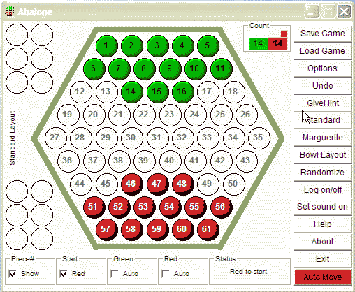
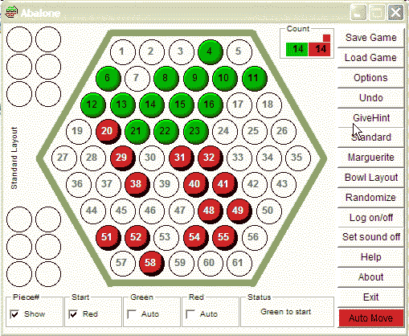

### Introduction

Two-player, strategy game Abalone was invented in 1990 by Laurent Levi and
Michel Lalet. The concept of the game is based on the popular Japanese Sumo
wrestling.

### Object of the Game

On a hexagonal board (radius 5) two to six players have armies of marbles.
Computer game plays with two players only. Players take turns "pushing" 1, 2 or
3 linearly connected marbles, attempting to push their opponents' marbles off
the board. First player to push 6 of their opponent's marbles off the board
wins.

### Layout of the Game

The game is played on a hexagonal board with 4 interlaced different size
hexagons, where the most exterior hexagon has 5 circular locations at each side.
In the middle there is a single location. As a total, there are 61 places on the
board. Each player has fourteen pieces that can rest in these 61 locations.
Initial game position for players in "Standard" layout is shown below:

### Movement of Pieces

You may move a group of 1, 2, or 3 adjacent pieces of your color (a group of 3
pieces must be in a straight line) one space in any one of the six possible
directions. A group of two or three marbles may push an opponent's smaller group
when moving in a direction that the line is pointing (i.e., not when moving
"sideways"). Once you have pushed six of the computer pieces off of the board,
you win! Typical valid moves on a layout shown below could be following:

-   Single Piece move: A single piece can move to any adjacent vacant position.
-   Moving in line: 31,32 to 33,34 or 40,48,55 to 48,55,61
-   Moving Sideways: 31,40,48 to 30,39,47
-   Push moves: 14,21,29 to 21,29,37 pushing red piece from 29 to 37
-   Sumito moves: 29,20 can push 12 out of board by moving to positions 20 and
    12. Or 38,29,20 can push 12 out of board by moving to positions 29,20 and
    12.

### How to move pieces in the program

-   Move a single piece: Left click on the piece, then right click on an
    adjacent empty position.
-   Move a row sideways: Left click all pieces in the row to move, then right
    click on one of the corner pieces (this piece will be highlighted by letter
    X). Right click on an adjacent empty position. The row will move sideways,
    shifting X piece to the empty location and other pieces accordingly.
-   Move a row in line: Left click all pieces in the row to move. Right click on
    an adjacent empty position. The row will move in line accordingly.
-   Move a row in line including opponent pieces. Same as 3 above, but do not
    left click on the opponent piece.
-   Eject an opponent piece: Left click on pieces behind the piece the opponent
    piece, then right click on piece to be ejected.

### Program Options

-   **Show Pieces**: Each of 61 locations on the board is numbered. Player
    pieces on the board can be displayed with or without numbers.
-   **Start**: Game can start with Green or Red player to go first.
-   **AutoPlayer**: Computer can play Red or Green or both automatically. Both
    players can be manual also.
-   **Automove**: Click this button for computer to take this turn.
-   **Save Game**: Save current game to a file for retrieval and play later.
-   **Load Game**: Load a game saved earlier.
-   **Allow Repeat Moves**: Allow computer to make repeat moves when computer is
    making automove.
-   **Show Pieces Raised**: Pieces will be displayed as raised instead of flat.
-   **Trace Moves**: This is a debug option to check the logic behind computer
    decisions. This option is generally not available. Contact the author for
    more details.
-   **Pause Interval**: Increase this value for computer to pause and show the
    move being made.
-   **Delete Trace Files**: Moves during a game are stored in a file
    "TraceOfLastGame;nn.aba". File number is incremented with each game. These
    files can be loaded and a game can be played again if required. Trace files
    can be deleted also.
-   **Undo**: Undo the previous move. Moves can be undone to the start of the
    game. Moves can also be undone after loading a saved game.
-   **Give Hint**: Computer will give hint for this move.
-   **Standard**: Restart the game with the standard board layout.
-   **Marguerite**: Restart the game with the marguerite board layout.
-   **Bowl Layout**: Restart the game with the bowl board layout.
-   **Random**: Restart the game with the random board layout.
-   **Log on/off**: Show/hide the moves log window.
-   **Sound on/off**: Set sound on or off.
-   **Help**: Provide help about the game.
-   Shortcut Keys:
    -   Escape = Stop automoves and set both players to manual. This allows
        interruption of game when both Green and Red are autoplay
    -   S or s = Set sound on or off
    -   + or - = Increase or decrease pause interval between automoves
    -   * = Remove pause interval between moves
    -   A or a = Let computer play this move

[Playing Tips by Wayne Schmittberger](http://www.games.net/)

-   At the start, advance your marbles quickly toward the center of the board.
    Marbles in the center are much safer, and can move around more easily, than
    ones near the edge. And, if you can occupy the center, you will also force
    your opponent's marbles to stay near the edge. (Unless your opponent(s) can
    outwit you and take over the center).
-   Keep your marbles together. Your marbles are strongest in a solid group. The
    more lines in which you have connected rows of three or more marbles, the
    harder it will be for your opponent to push you back toward the edge.
-   "Divide and Conquer. Try to separate the opponent's marbles into two or more
    groups. Smaller groups will be easier to push back and trap against the edge
    of the board, where they will be lost.
-   Plan ahead. Wherever your marbles are next to your opponent's, carefully
    consider the effect of each possible push. Pushes tend to create many new
    possibilities for each side, since as many as five marbles can change
    position at once (when three marbles push two).
-   Think twice before pushing an opponent's marble off the board. Early in the
    game, it is usually more important to keep your marbles in the center than
    to move them toward the edge in order to eject a marble or two. (If you fall
    behind 2-0 or 3-1 in pushing off marbles, you can easily catch up if you
    have the more central position.) And if an opponent's marble has no way to
    escape, don't hurry to push it off, as you will usually have a more
    important move to make elsewhere.
-   Abandon stragglers. Don't waste time trying to link up isolated marbles with
    your main group, unless you can do it in just a move or two.
-   Play patiently. When you're not sure what to do, look for your least useful
    marble(s), and try to improve their positions.
-   The more marbles that have been pushed off the board, the more important it
    is to gain the lead in marbles. Although a strong central position is more
    important than ejecting marbles early in the game, the opposite is true
    after each side has lost three or four marbles. If your marbles are badly
    scattered around the edges after you have pushed off six of your opponent's
    marbles, it won't matter!
-   Try hard to be the first player to eject five marbles. The first player to
    push off a fifth marble will usually have a big advantage, because the
    opponent will then have to look after every vulnerable marble, and answer
    every threat to eject a marble.
-   Late in the game, play accurately and aggressively. If you see a way to
    eject enough of the opponent's marbles to bring your total up to six, don't
    bother to defend your own marbles unless the opponent can win before you do.

### About Abalone

This program was written in VB6, based on information available on web sites,
too numerous to acknowledge. Special thanks to Asim and David Millar.
