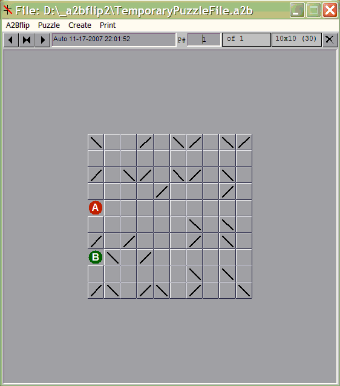
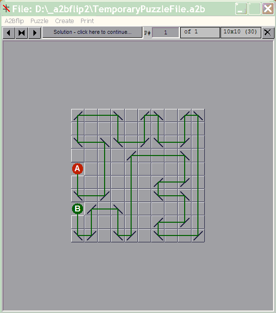

### Introduction

A2Bflip, derived from Japanese puzzle game Masyu, is played on a grid of
squares, some of which contain 'mirrors'. The goal is to connect circles A and
B:

-   Go from A to B in a single continuous line; A and B can be located anywhere
    in the grid
-   Must use all mirrors
-   Line turns right angle at a mirror
-   Cannot use a mirror twice
-   Cannot pass through a cell twice
-   Cannot turn in any cell without a mirror

### Features

-   Create new puzzles manually or automatically with different grid sizes from
    5x5 to 24x24
-   Solve existing puzzles interactively or on paper
-   Print puzzles and solutions
-   20,000 puzzles with solutions are provided

### Sample Layout

Puzzle:

Solution:

### Solving a Puzzle Manually

1.  Click A to set the start direction
2.  Click a mirror to flip direction
3.  Contunue adjusting mirrors until the line reached B
4.  Click on A to start with another sirection

### Making a Puzzle - Manually

1.  Click EDIT button and go to edit mode
2.  Create a new grid of desired size
3.  Double-click on a cell to add/remove circles or a mirror
4.  A new puzzle will normally be defined as a single continuous line from A to
    B.
    -   Left click on a cell. With left button down, drag mouse over to the
        destination cell. Release left click. If this is a valid connection a
        line will be drawn
    -   Continue mouse move and left clicks to continue drawing the line
    -   Invalid loops will not be drawn
    -   Use right click instead of left click if you wish to clear a line
    -   As in other loop-construction puzzles, "short circuits" need to be
        avoided: as the solution must consist of a single loop. Any segment that
        would close a loop is forbidden unless it leads to circle B.
5.  Normally there should no need to add mirrors, the line segments will
    determine the placement of mirrors
6.  Save the puzzle after a valid line is drawn from A to B
7.  The complexity of the path from A to B will depend on your imagination.

### Solving a Puzzle - by Computer

Click Solve/AutoSolve button to let computer solve a puzzle. Click Cancel at the
top right of the display to stop this function.

Note that this program employs a set of rules to successively reduce the number
of valid choices. If reduction does not result in a solution, a trial and error
approach is used. Computer will eventually find a solution to any valid puzzle.
However for some puzzles of size 20x20 and above computer may take some time to
get a solution. TOP

### View Solution

Puzzle solutions, by computer or manual, can be stored in the puzzle file along
with the puzzle. Click Solve and View step-by-step or otherwise.

### Compiling New Puzzles

Puzzles can be compiled one at a time or in bulk.

#### Single Puzzle Create

1.  Click Create/NewGrid to set the grid size
2.  Click Create/OnePuzzle to create a new puzzle of the displayed grid size
3.  New puzzle will also be saved in a temporary file: TemporaryPuzzleFile.a2b
4.  A solution is also created as part of the newpuzzle

### Multiple Puzzle Create

1.  Click Create/MultiplePuzzles
2.  Define the grid size and whether fixed or random; random size will be chosen
    from 5x5 to 24x24
3.  Preset Circles locations if required
4.  Set how many puzzles you want to create
5.  Select the file where new puzzles will be saved
6.  Click Create, new puzzles will be stored in the file specified

### Saving Puzzles

A puzzle and its solution can be saved into a file or appended to the currently
loaded file. Solutions are saved with the puzzle. A solution saved along with
the puzzle can be viewed without obtaining a solution; use Solve/ShowSolution
menu command for this purpose.

### Loading Saved Puzzles

Use Mirrors/File/Load menu to load puzzles saved in a file.

### Sorting a Puzzle file

You can sort any puzzle file by the number of rows or by the puzzle title. This
option can also resequence puzzle numbers. Use Mirrors/File/Sort for this
purpose.

### Printing

The current puzzle or its solution will be printed on an A4 sheet. You can also
print multiple puzzles from an existing puzzle file. Puzzle solutions will be
taken from the file.

### About A2B

This program was written in VB6, based on information available on web sites,
too numerous to acknowledge. This program is free to use and distribute but
cannot be used for commercial purposes.