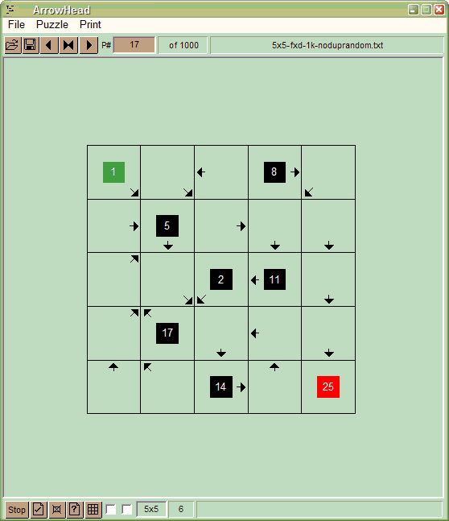
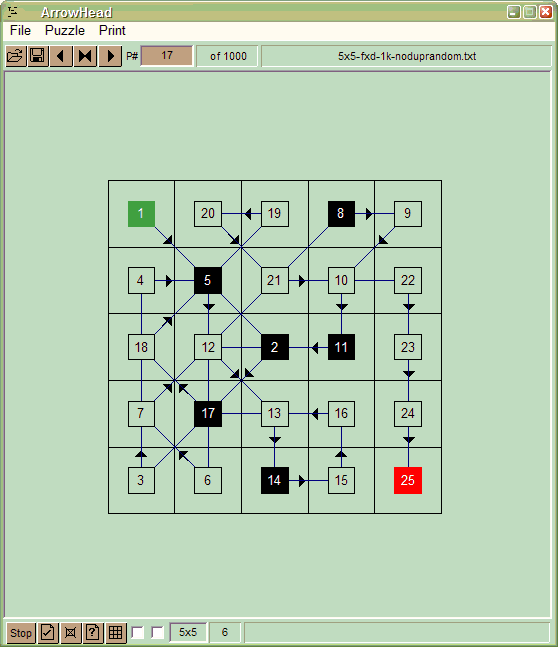

### Introduction

Draw a single continuous link from a start location 1 to an end maximum number
location. The link is unique, continuous and must go through each cell once.
Link lines can cross each other at number cells but cannot overlap. Each puzzle
has a unique solution.

-   Start number is 1, end number depends on the grid size like 49 for a 7x7
    grid etc
-   Link is continuous but in stages starting from number 1. First stage will be
    1 to 2, second 2 to 3 etc until the end number. For example a puzzle with
    end number 25 will have 24 stages in the link.
-   Arrows show the direction in which a link must travel. For example a down
    arrow in cell with number 1 indicates that the link from 1 to 2 must go
    downwards.
-   Link from a cell can go in 8 directions: left, right, up, down, diagonal
    left up, diagonal right up, diagonal left down, and diagonal right down
-   While you must follow the direction in each cell, how far you travel is up
    to you
-   You must place a number in the cell at the end of each stage
-   Each cell must be filled by a number, some numbers are given as hints
-   Link lines can cross each other at number cells but cannot overlap
-   Some cells may be blacked out, these cells have no numbers and a link cannot
    go through them
-   Each puzzle has a unique solution

### Program Features

-   Create new puzzles manually or automatically
-   Puzzle size 3x3 to 12x12 in any combination like 5x7 or 12x6 etc
-   Specify start and end locations of the loop
-   Solve on screen
-   Print single or multiple puzzles with solutions
-   Copy a puzzle and its solution to clipboard
-   Display colour schemes of your choice
-   Use one of 20,000 ready made puzzles 2.6Mb

### Sample Layout

Puzzle

Solution

### Compiling New Puzzles

Puzzles can be generated and saved to a file.

1.  Set the grid size 3x3 to 12x12
2.  Set start and end value locations, default is top left and bottom right
3.  For puzzle sizes above 7x7 a puzzle may have some blank cells. A number
    cannot be placed in such cells. You can disable blank cells, however puzzle
    creation may take some time in such cases.

### Solving a Puzzle

Puzzle solution involves drawing a link in stages from start value to end value.
Each stage increases the cell value by one, until the end value is reached. Some
cell values are given as hints.

1.  To draw a stage, place mouse over a number (source cell) and then drag
    cursor with left button pressed to the destination cell and release left
    button. Stage will be drawn from source to the destination cell:
    -   Destination cell number will be one plus the sources cell value
    -   The link direction must be in the direction indicated in the source cell
    -   Cannot have more than one link at a number
    -   Links can cross each other at cells but cannot overlap
2.  Puzzle is solved when you reach the end value:
    -   All cell values would have been filled, except the blocked cells if any
        in the puzzle
    -   Any given values will be in the correct sequence of cells visited
    -   Link will follow directions given in the cells
    -   There will be no overlapping lines
3.  Use Solve/Verify menu to verify the link
4.  To adjust the grid display size: Rightclick on the display outside the grid
    and drag mouse left or right to decrease or increase the display window size

### Loading Saved Puzzles

Use Load menu to load puzzles saved in a file.

### Printing

The current puzzle and its solution will be printed on an A4 sheet. You can also
print multiple puzzles from an existing puzzle file, puzzle solutions will be
taken from the file.

### About ArrowHeads Program

This program is free to use and distribute but cannot be used for commercial
purposes. Original idea from BBC Focus Magazine. ihsan@ihsan.biz
